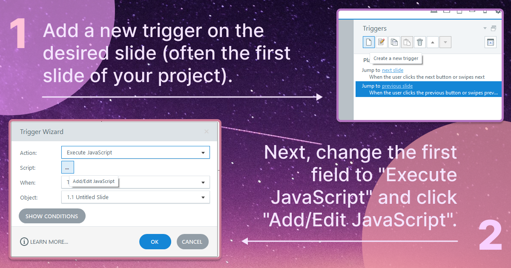
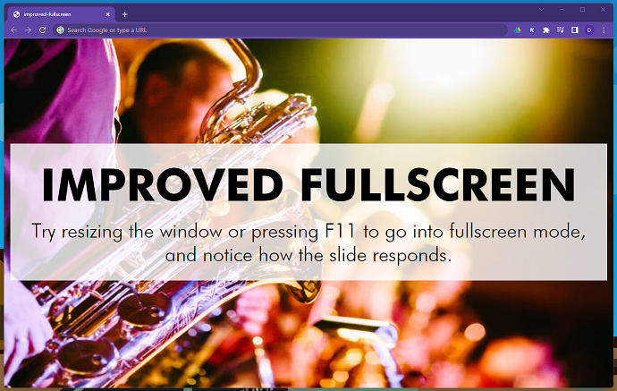
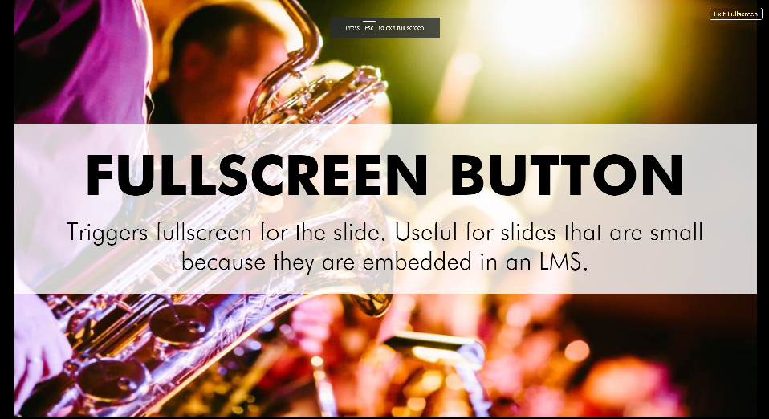
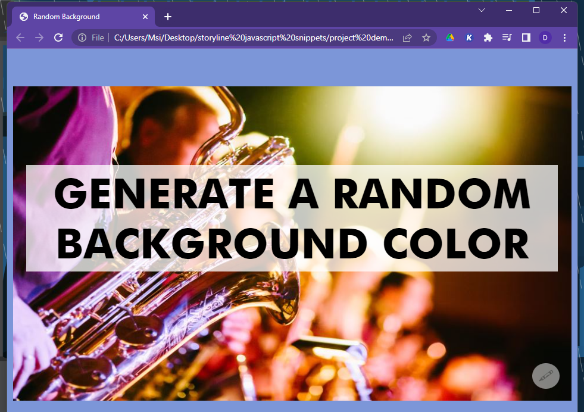

# JAVASCRIPT SNIPPETS FOR ARTICULATE STORYLINE

This is a collection of JavaScript that can be used in Articulate Storyline to make modifications otherwise unavailable within the software. The code currently focuses on making visual modifications, but suggestions are welcome. These snippets have been tested in Articulate Storyline 3; if you are able to test in other versions please feel free to contribute your findings.

## :question: HOW TO USE 



You can then copy and paste any of the code you find here in the window that appears. Now, anytime you preview your project it will tell you that JavaScript preview is not available. You will have to publish your project to see any of the changes.

If you have any trouble using this code, the .story files are in the project demos folder! Feel free to download them yourself and see if it helps solve your issue.

## :scissors: THE SNIPPETS

- [Improved Fullscreen](#1-improved-fullscreen)
- [Fullscreen Button](#2-fullscreen-button)
- [Get Rid of the Player Border and Colors](#3-remove-the-border-and-player-background)
- [Random Background Color](#4-random-background-color-button)
- [APPENDIX: Most Common Selectors](#appendix-list-of-most-common-selectors)

---

## 1. Improved Fullscreen 

💻 [demo](https://itsdani.me/sl/improved-fullscreen/story.html)



**What it does:** Takes the background image you have added to your slide, removes it, and makes it the background image of the browser window, giving the project a fullscreen effect. The rest of the content is unchanged. 

I have seen similar solutions which require you to make your slide backgrounds transparent, but I appreciate this solution preserving the original slide background so the thumbnail generated by Storyline includes the slide background.

To use, add this code to the first slide in your presentation:

```
const slideContainer2 = document.querySelector('.slide-transition-container');
const bgSlideContainer = slideContainer2.querySelector('.slide');
const bgImg = bgSlideContainer.querySelector('image');
const href = bgImg.href.baseVal;

bgImg.remove();

document.body.setAttribute('style', `background: url(${href}); background-repeat: no-repeat; background-size: cover`);
```

If the remaining slides all use the same background image as the first one, you can add the following trigger to each slide so you don't get a duplicate:

```
const [:top:(top)](#)slideContainer2 = document.querySelector('.slide-transition-container');
const bgSlideContainer = slideContainer2.querySelector('.slide');
const bgImg = bgSlideContainer.querySelector('image');

bgImg.remove();
```

If each slide uses a different background image, then add the first snippet on each slide.

:top: [[top]](#javascript-snippets-for-articulate-storyline)


## 2. Fullscreen Button 

💻 [demo](https://itsdani.me/sl/fullscreen-button/story.html)



**What it does:** Adds a fullscreen button to your project. The styles can be changed to match the colors in your project. The button will appear at the top right of your slide (this can be changed in the styles section). Clicking the button will cause the entire slide to stretch to fill the screen, keeping the aspect ratio (which may result in a small bit of black space on the sides). I really wished for this feature when I was working in sites like Moodle, because the embed feature makes the slides far too small for mobile devices. Articulate 360 does apparently have a fullscreen button for mobile devices now, but as far as I'm aware this feature is not planned to be added to earlier versions.

**Note:** In some cases, the project will load new slides on top of the button, hiding it from view. I have not found another workaround for this aside from adding the code to each slide.

```
const slide = document.querySelector('.slide-transition-container');
const container = slide.querySelector('.slide');

let fullscreen;
let fsBtn = document.createElement('button');
fsBtn.innerHTML = 'Go Fullscreen';

// STYLES:
const css = `
    .fs-button {
        position: absolute; 
        top: 20px; 
        right: 20px; 
        z-index: 11; 
        border: 1px solid #fff; 
        border-radius: 5px; 
        font-size: 1.5rem; 
        padding: 0.5rem 0.7em; 
        background-color: rgba(0,0,0,0.2); 
        color: #fff; 
        font-family: Verdana, Geneva, Tahoma, sans-serif; 
        -webkit-font-smoothing: antialiased; 
        cursor: pointer; 
        transition: all .3s;
        width: max-content;
    }

    .fs-button:hover {
        background-color: rgba(255,255,255,0.2);
        color: #000;
    }

    .slide-transition-container {
        display: flex;
        justify-content: center;
        align-items: center;
    }

    .slide-transition-container .slide {
        position: relative;
        left: unset;
        top: unset;
    }

    .slide-layer {
        position: absolute;
        top: 0;
        left: unset;
        margin: auto;
    }

`;
const style = document.createElement('style');
if (style.styleSheet) {
    style.styleSheet.cssText = css;
} else {
    style.appendChild(document.createTextNode(css));
}
document.querySelector('head').appendChild(style);
fsBtn.classList.add('fs-button');

function toggleFullScreen() {
    if (!document.fullscreenElement) {
        // if we are in Fullscreen mode, the text should say Exit Fullscreen
        fsBtn.innerHTML = 'Exit Fullscreen';
        slide.requestFullscreen();
    } else {
      if (document.exitFullscreen) {
        // if we are not in Fullscreen mode, the text should say Go Fullscreen
			fsBtn.innerHTML = 'Go Fullscreen'; 
          document.exitFullscreen();
      }
    }
  }

// this class lets us know the button has been added so that if we revisit this slide we don't get a bunch of buttons
fsBtn.classList.add('added'); 

// if we don't already have a button on the page, go ahead and add it:
if (!document.body.querySelector('.added')) { 
	container.appendChild(fsBtn); 
    fsBtn.addEventListener('click', function (e) {
        e.preventDefault();
        toggleFullScreen();
    });
}

```

:top: [[top]](#javascript-snippets-for-articulate-storyline)

## 3. Remove the Border and Player Background

💻 [demo](https://itsdani.me/sl/invisible-player/story.html)

**What it does:** Gets rid of the border and background caused by the player window. Yes, this can be done in the player settings, but it takes a long time to do so. This bit of code added to your project takes care of it for you. You still have to make sure any unwanted buttons are turned off in the settings.

```
const frame = document.querySelector('#frame');
frame.setAttribute(
	'style',
	`border-radius: 0;
	border: none;
	background: transparent;
	width: 100%;
	height: 100%;`
);
```

:top: [[top]](#javascript-snippets-for-articulate-storyline)

## 4. Random Background Color Button

💻 [demo](https://itsdani.me/sl/random-bg/story.html)



**What it does:** Adds a clickable button that will change the page background to a random color. Note that any text on the slide will not change color, so transparent slide backgrounds are not recommended. 

```
const slide = document.querySelector('.slide-transition-container');
const container = slide.querySelector('.slide');

const css = `
.bg-btn {
    background-color: #ffffff;
    color: #aaaaaa;
    opacity: 0.5;
    border: 0px solid transparent;
    border-radius: 50%;
    font-size: 2em;
    padding: 0.25em 0.4em;
    position: absolute;
    bottom: 20px;
    right: 20px; cursor: pointer;
    transition: opacity 300ms;
    font-family: Arial, sans-serif;
}

.bg-btn:hover {
    opacity: 1;
}
`;
const style = document.createElement('style');
if (style.styleSheet) {
	style.styleSheet.cssText = css;
} else {
	style.appendChild(document.createTextNode(css));
}
document.querySelector('head').appendChild(style);

const bgBtn = document.createElement('button');
bgBtn.innerHTML = '&#128397;';

const possibleColorValues = [ 0, 1, 2, 3, 4, 5, 6, 7, 8, 9, 'a', 'b', 'c', 'd', 'e', 'f' ];

const generateRandomColor = () => {
	const baseVal = [ 0, 0, 0, 0, 0, 0 ];
	let str = '#';
	for (val of baseVal) {
		str += `${possibleColorValues[Math.floor(Math.random() * (16 + 1))]}`;
	}
	return str;
};

bgBtn.classList.add('bg-btn');
if (!document.body.querySelector('.bg-btn')) {
	container.appendChild(bgBtn);
	bgBtn.addEventListener('click', function(e) {
		e.preventDefault();
		document.body.style.backgroundColor = generateRandomColor();
	});
}

```

:top: [[top]](#javascript-snippets-for-articulate-storyline)

## APPENDIX: List of Most Common Selectors

**What it does:** This is a list of items that can be selected via javascript and altered in some way. There are definitely more, but these are the ones I've found most useful. I listed them in nested order, from top level down. I skipped containers that do not alter the style in any way.

```
// 1. wrapper: the div that contains all the slide content
const wrapper = document.querySelector('#wrapper');

// 2. frame: nested inside wrapper, this also contains all the slide content
const frame = document.querySelector('#frame');

// 3. slide: another container
const slide = document.querySelector('#slide');

// 4. main: the purpose for selecting this is to get "slideContainer2", because it has the same class name as "main" and therefore the querySelector will pick up this one before it picks up the other one
const main = document.querySelector('main');

// 5. slideWindow: another container
const slideWindow = document.querySelector('#slide-window');

// 6. slideContainer: another container
const slideContainer = main.querySelector('.slide-container');

// 7. slideContainer2: another container
const slideContainer2 = document.querySelector('.slide-transition-container');

// 8. bgSlideContainer: finally, a div that has something useful
const bgSlideContainer = slideContainer2.querySelector('.slide');

// 9. bgImg = the image tag which contains the slide's background image
const bgImg = bgSlideContainer.querySelector('image');

// 10. href = the URL of the background image
const href = bgImg.href.baseVal;

// 11. slideContainer3: the last main container which contains all the slide objects
const slideContainer3 = document.querySelector('.slide-layer');

// 12. slideObject: this will select the FIRST item in the previous container with the class name "slide-object"
const slideObject = slideContainer3.querySelector('.slide-object');
```

:top: [[top]](#javascript-snippets-for-articulate-storyline)
